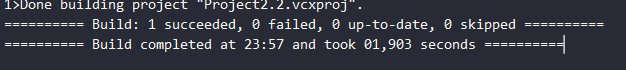

# Project2_Task4
# Звіт до лабораторної роботи 2
**Студентки** Макарової Софіїї Денисівни
**групи** К27

## Тема: Дослідження продуктивності алгоритму std::count_if

## Мета роботи
Дослідити швидкодію стандартного алгоритму std::count_if:
    1. Без використання політики виконання.
    2. З різними політиками (seq, unseq, par, par_unseq).
    3. Створити власну паралельну реалізацію, яка:
        ◦ розбиває вибірку на K частин;
        ◦ обробляє кожну частину у окремому потоці;
        ◦ зводить результат послідовно.
    4. Визначити залежність часу виконання від кількості потоків K.
    5. Порівняти найкраще значення K з кількістю апаратних потоків процесора.
 
 ## Опис програми
    • Для генерації випадкових послідовностей використано <random>.
    • Перевірялися два предикати:
        1. x > 500000
        2. x % 7 == 0
    • Обсяги даних: 100 000, 1 000 000, 5 000 000 елементів.
    • Для кожного тесту проводилось кілька повторів, фіксувався найменший час.
    • Порівнювались: стандартні бібліотечні алгоритми та власна паралельна реалізація.

## Результат

 ## Висновки
    • Власна паралельна реалізація демонструє покращення швидкодії при збільшенні кількості потоків до певної межі.
    • Найкраще значення K зазвичай збігається або близьке до кількості апаратних потоків процесора.
    • Подальше збільшення K призводить до зниження ефективності через накладні витрати на створення потоків.
    • Збірка у Release значно швидша, ніж у Debug, що підтверджує вплив оптимізації компілятора.
    • Результати std::execution::par та par_unseq близькі до швидкодії власної реалізації при оптимальному K.

## Додаткові скріни відображення роботи

